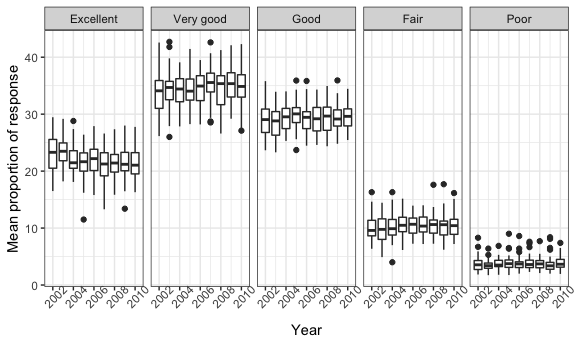
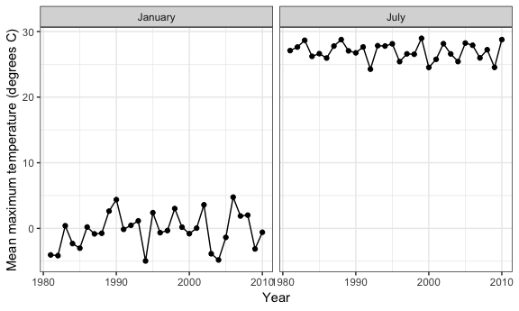

p8105\_hw3\_dry2115
================
Dayoung Yu
2018-10-15

Problem 1
---------

Read and clean brfss\_smart2010 data:

``` r
library(p8105.datasets)

brfss_df = as.tibble(
  brfss_smart2010 %>%
  janitor::clean_names() %>%
  rename(state = locationabbr, county = locationdesc) %>%
  filter(topic == "Overall Health") %>%
  mutate(response = factor(response, levels = c("Excellent", "Very good", "Good", "Fair", "Poor"))) %>%
  arrange(response)
)
```

Find states that were observed at 7 locations:

``` r
brfss_df %>%
  filter(year == 2002) %>%
  group_by(state) %>%
  summarize(n_locations = n_distinct(county)) %>%
  filter(n_locations == 7) %>%
  knitr::kable()
```

| state |  n\_locations|
|:------|-------------:|
| CT    |             7|
| FL    |             7|
| NC    |             7|

Connecticut, Florida, and North Carolina were observed at 7 locations.

Spaghetti plot that shows the number of locations at each state from 2002 to 2010:

``` r
brfss_df %>%
  filter(year %in% (2002:2010)) %>%
  group_by(state, year) %>%
  summarize(n_locations = n_distinct(county)) %>%

  ggplot(aes(x = year, y = n_locations, color = state)) +
    geom_smooth(se = FALSE) +
    theme(legend.position = "none") +
    labs(
      title = "Number of Distinct Locations by State in 2002-2010",
      x = "Year",
      y = "N distinct locations"
    )
```


Proportion of "Excellent" responses in NY locations in 2002, 2006, and 2010:

``` r
brfss_df %>%
    filter(state == "NY", response == "Excellent", year %in% c(2002, 2006, 2010)) %>%
    group_by(year) %>%
    summarize(mean_prop = mean(data_value), sd_prop = sd(data_value)) %>%
    knitr::kable(digits = 1)
```

|  year|  mean\_prop|  sd\_prop|
|-----:|-----------:|---------:|
|  2002|        24.0|       4.5|
|  2006|        22.5|       4.0|
|  2010|        22.7|       3.6|

Compute average proportions in each response category for each state and year:

``` r
brfss_df %>%
  group_by(response, year, state) %>%
  summarize(mean_prop = mean(data_value)) %>%
  
  ggplot(aes(x = year, y = mean_prop, color = state)) +
  geom_point(se = FALSE) + 
  facet_grid(~response) +
  theme(legend.position = "none") +
  theme(axis.text.x = element_text(angle = 45)) +
  labs(
      x = "Year",
      y = "Mean proportion of response"
    )
```



Problem 2
---------

``` r
instacart %>%
  group_by(aisle) %>%
  summarize(n_items = n()) %>%
  arrange(desc(n_items)) %>%
  top_n(3)
```

    ## Selecting by n_items

    ## # A tibble: 3 x 2
    ##   aisle                      n_items
    ##   <chr>                        <int>
    ## 1 fresh vegetables            150609
    ## 2 fresh fruits                150473
    ## 3 packaged vegetables fruits   78493

There are 134 distinct aisles.The top three aisles from which items are ordered are "fresh vegetables", "fresh fruits", and "packaged vegetables fruits".

Plot of the number of items ordered in each aisle:

``` r
aisle_top = (instacart %>%
  head(67) %>%
  ggplot(aes(x = aisle)) +
  geom_bar() + 
  coord_flip() +
  theme(text = element_text(size = 6)))

aisle_bottom = (instacart %>%
  tail(67) %>%
  ggplot(aes(x = aisle)) +
  geom_bar() + 
  coord_flip() +
  theme(text = element_text(size = 6)))

aisle_top + aisle_bottom
```


Table of most popular items in “baking ingredients”, “dog food care”, and “packaged vegetables fruits”:

``` r
instacart %>%
  filter(aisle == c("baking ingredients", "dog food care", "packaged vegetables fruits")) %>% 
  group_by(aisle, product_name) %>%
  summarize(n_items = n()) %>%
  arrange(desc(n_items)) %>%
  group_by(aisle) %>%
  top_n(1) %>%
  select(-n_items) %>%
  rename(most_popular_item = product_name) %>%
  knitr::kable()
```

    ## Selecting by n_items

| aisle                      | most\_popular\_item                             |
|:---------------------------|:------------------------------------------------|
| packaged vegetables fruits | Organic Baby Spinach                            |
| baking ingredients         | Light Brown Sugar                               |
| dog food care              | Organix Grain Free Chicken & Vegetable Dog Food |

Table showing the mean hour of the day at which Pink Lady Apples and Coffee Ice Cream are ordered on each day of the week:

``` r
instacart %>%
  filter(product_name == c("Pink Lady Apples", "Coffee Ice Cream")) %>% 
  group_by(product_name, order_dow) %>%
  summarize(mean_hour = mean(order_hour_of_day)) %>%
  mutate(mean_hour = paste(floor(mean_hour), 
                    sprintf("%02.0f",(round((mean_hour - floor(mean_hour))*60))), 
                    sep = ":")) %>%
  spread(key = order_dow, value = mean_hour) %>%
  rename(Sun = '0', Mon = '1', Tues = '2', Wed = '3', Thur = '4', Fri = '5', Sat = '6') %>%
  knitr::kable()
```

| product\_name    | Sun   | Mon   | Tues  | Wed   | Thur  | Fri   | Sat   |
|:-----------------|:------|:------|:------|:------|:------|:------|:------|
| Coffee Ice Cream | 13:13 | 15:00 | 15:20 | 15:24 | 15:10 | 10:20 | 12:21 |
| Pink Lady Apples | 12:15 | 11:41 | 12:00 | 13:56 | 11:55 | 13:52 | 11:33 |

Because no other information was given, it was assumed that "0" = Sunday, "1" = Monday, ..., "6" = Saturday.

Problem 3
---------

Exploratory analysis of the NY NOAA data set:

The ny\_noaa contains core weather data (precipitation, snowfall, snowdepth, max temp, and min temp) for all weather stations in New York from 1981-01-01 to 2010-12-31. There are 2595176 observations in the ny\_noaa data set. The data set contains a significant number of missing data.The proportion of missing data for the variables id, date, prcp, snow, snwd, tmax, tmin is 0, 0, 0.0561958, 0.146896, 0.2280331, 0.4371025, 0.4371264, respectively. We can see that almost 50% of tmax and tmin variables are missing.

Clean NY NOAA:

``` r
ny_noaa_df = as.tibble(ny_noaa %>%
  mutate(year = lubridate::year(date),
         month = lubridate::month(date),
         day = lubridate::day(date),
         prcp = prcp/10,
         tmax = (as.integer(tmax))/10,
         tmin = (as.integer(tmin))/10) %>%
  select(-date))
```

Precipitation was in (tenths of mm), so it was divided by 10 to make the units (mm). Tmax and tmin were coerced into integer variables and also divided by 10 to make the units (degrees C) instead of (tenths of degrees C).

Two panel plot of average max temperatures in January and July:

``` r
labels = c("1" = "January", "7" = "July")

ny_noaa_df %>%
  filter(month == c(1,7)) %>%
  group_by(month, year) %>% 
  summarize(mean_tmax = mean(tmax, na.rm = TRUE)) %>% 
  ggplot(aes(x = year, y = mean_tmax)) +
  geom_point() +
  geom_line() +
  facet_grid(~month, labeller = as_labeller(labels)) +
    labs(
      x = "Year",
      y = "Mean maximum temperature (degrees C)"
    )
```



Make a two-panel plot showing (i) tmax vs tmin for the full dataset (note that a scatterplot may not be the best option); and (ii) make a plot showing the distribution of snowfall values greater than 0 and less than 100 separately by year

``` r
tmax_tmin_plot = ny_noaa_df %>%
  ggplot(aes(x = tmax, y = tmin)) +
  geom_hex() 


snow_plot = ny_noaa_df %>%
  filter(snow > 0 & snow < 100) %>% 
  group_by(year) %>%
  ggplot(aes(x = snow, fill = year)) +
  geom_density()

(tmax_tmin_plot + snow_plot)
```

    ## Warning: Removed 1136276 rows containing non-finite values (stat_binhex).


